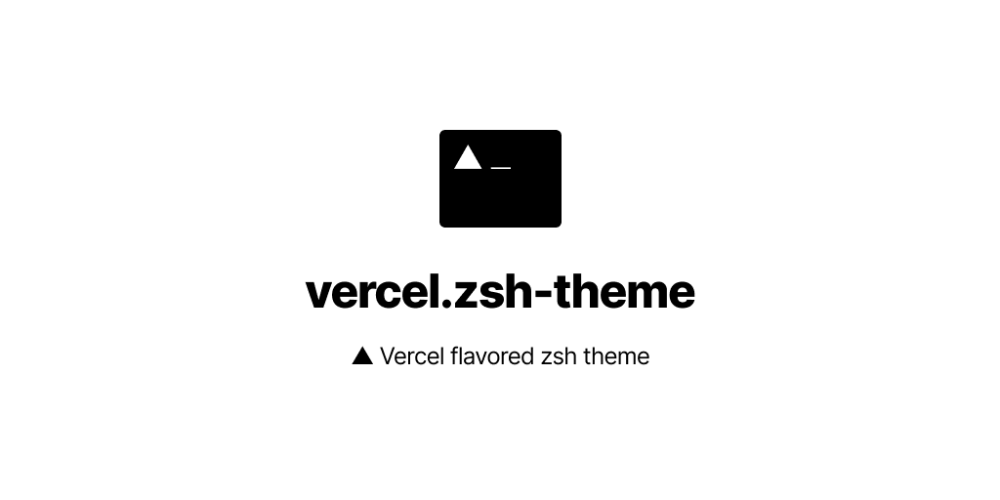
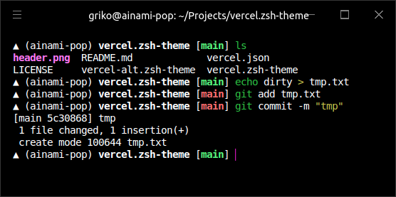
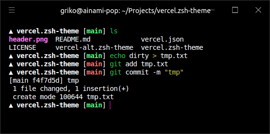

<!-- markdownlint-disable MD033 MD036 MD041 -->



<!-- https://www.figma.com/file/AYvctU07n0jWZNUT7CwSL5/vercel-zsh-theme -->

## Variants

| [`vercel.zsh-theme`](./vercel.zsh-theme)  | [`vercel-alt.zsh-theme`](./vercel-alt.zsh-theme)  |
| :---------------------------------------: | :-----------------------------------------------: |
|           `▲ (your-hostname) ~`           |                       `▲ ~`                       |
|  |  |

## Usage

### Using [antigen](https://github.com/zsh-users/antigen)

```bash
antigen theme vercel/zsh-theme
antigen apply
```

### Manual installation

**Download theme file**

```bash
# default version
curl https://raw.githubusercontent.com/vercel/zsh-theme/master/vercel.zsh-theme \
  -Lo ${ZSH_CUSTOM:-~/.oh-my-zsh/custom}/themes/vercel.zsh-theme

# alternate version (no hostname)
curl https://raw.githubusercontent.com/vercel/zsh-theme/master/vercel-alt.zsh-theme \
  -Lo ${ZSH_CUSTOM:-~/.oh-my-zsh/custom}/themes/vercel.zsh-theme
```

**Set theme in `~/.zshrc`**

```bash
ZSH_THEME="vercel"
```

**Apply theme**

```bash
source ~/.zshrc # or restart terminal session
```

## License

[MIT License, Copyright (c) 2020 Vercel](./LICENSE)
